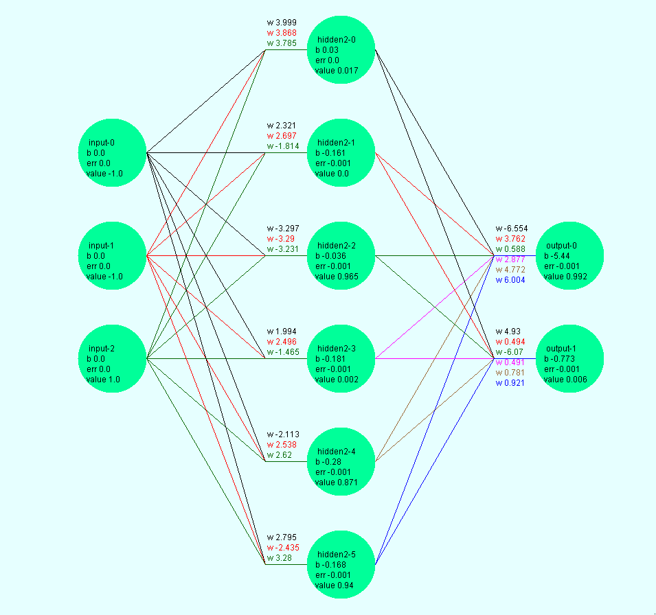

# neuralnetworks

Taking a full adder as an example we use a network of 3 Layers
Fairly simple but it shows how our nueral network goes through all its maths and comes up with a solution of its own

| Layer | Description | 
| --- | --- |
| input | 3 input neurons (in1 , in2, carryin)|
| hidden | 6 neurons we could use as few or as many as we need|
| output| 2 neurons sum and carryout|  

Truth table for full adder

| in1 | in2 | cin| sum| cout|
| --- | --- |--- | --- | --- |
|0|0|0|0|0
|0|0|1|1|0
|0|1|0|1|0
|0|1|1|0|1
|1|0|0|1|0
|1|0|1|0|1
|1|1|0|0|1
|1|1|1|1|1   

- We randomly come up with weights ( a number between 0 and 1) 
- Pass through the first row 
- Get the output
- Pass back the error
- Adjust each weight by a small bit ( Get a small bit closer to the solution)
- Pass the next row and so on.
- Keep going until the result matches the expected for each row in the truth table.
 
###Some variable definitions

| Name | Description |
| --- | --- |
|Sigmoid |        Function to calculate output of neuron  1/(1 + e^-Z) |
| w(x) |      weight a neuron assigns to input(x) 
|Z  |             Sum of all weights * inputs  w(1)*input(1) + w(2)*input(2) + .. + w(x)*input(x) + ... + w(n)  - bias 
| bias |  This neuron also has a bias

- We set each neuron in the input layer to its value
- Each neuron in the hidden layer calculates its result using Sigmoid
- Each neuron in the output layer calculates its result using Sigmoid 
- We pass the expected values to the output layer
- Using the expected values each neuron in teh output layers adjusts 

Adjust each weight by an errorVariable
Maths is hard but a small change in each weight causes a small improvement in the cost
So we calculate the partial derivative  of each weight with respect  to Cost
Then adjust this weight by a multiple of this  partial derivative 
Derivative rules here https://www.mathsisfun.com/calculus/derivatives-rules.html
###Some variable definitions
| Name | Description |
| --- | --- |
| T   |            Expected value |
|Sigmoid |        Function to calculate output of neuron  1/(1 + e^-Z) |
|Z  |             Sum of all weights * inputs  w(1)*input(1) + w(2)*input(2) + .. + w(x)*input(x) + ... + w(n)*input(n)| 
|Cost|            Squared difference between expected and actual(Sigmoid)   0.5 *( T - Sigmoid)^2 
|pdW(x)-Cost|     Partial derivative  of weight with respect  to Cost   
|pdW(x)-Z|        Partial derivative  of weight with respect  to Z
|pdZ-Sigmoid|     Partial derivative  of Z with respect  to Sigmoid
|pdSigmoid-Cost|  Partial derivative  of Sigmoid  respect  to Cost
|Error |          Useful variable  pdZ-Sigmoid *  pdSigmoid-Cost

       
Using chain rule pdW-Cost =  
 pdW(x)-Sigmoid * pSigmoid-Cost  = 
 pdW(x)-Z  *  pdZ-Sigmoid * pdSigmoid-Cost
 Mad but true.   As Cost is computed from Sigmoid which in turn is computed from Z which in turn is computed using W(x)

 pdW(x)-Z is just   input(x) as we can treat the other coeffs in Z as constants ( we are only making a small change in W(x) and therefore they have a derivative of 0
 pdZ-Sigmoid is more fun  Sigmoid = 1/(1 + e^-Z)
 Reciprocal Rule  derivative of 1/f =   -df/(f^2)    
 f =  1 + e^-Z
 Derivative of 1 +e-Z =  -e-Z  so -df = e-Z 
 f sqaured = 
 df  = e^-z   We drop the 1 and the derivative e^x = e^x 
 f^2 = (1 + e^-Z) * (1 + e^-Z))  
 
 so thats
  1/(1 + e^-Z)  -  e^-z/((1 + e^-Z) * (1 + e^-Z))
    
